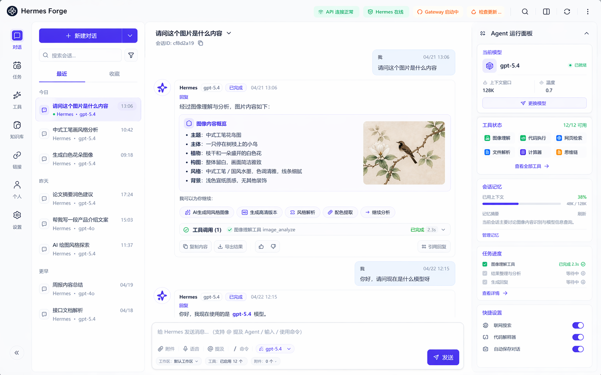

# Hermes Forge

Hermes Forge 是一个基于 Electron、React 与 Tailwind CSS 构建的本地优先 Hermes Agent 桌面工作台。

它将 Hermes CLI、本地工作区、流式任务执行、运行时配置、模型配置以及可选的 Windows / WSL 桥接能力整合到一个桌面客户端中。项目目标不是做一个封闭产品，而是提供一个可以被社区审查、改造、扩展和长期共建的本地 Agent 工作台。

> 说明：由于本人 token 紧张，个人开发和维护能力有限，因此将项目开源出来，希望社区一起参与改进、重构和完善 Hermes Forge。

Hermes Forge 不是 Hermes Agent 的官方客户端，而是围绕 Hermes Agent 桌面体验进行探索的社区项目。



## 当前状态

项目目前处于早期公开发布阶段。核心桌面壳、Hermes 运行时检测、一键部署 Hermes、统一 `task:event` 任务链路、主进程审批、安全 IPC 边界、本地工作区模型和连接器运行时基础能力已经具备。

但它还不是一个完整成熟的生产级客户端。部分功能仍是原型、占位或基础实现，需要社区继续推进。请重点查看 [当前不足](#当前不足) 和 [ROADMAP.md](ROADMAP.md)。

## 核心能力

- 本地优先的 Hermes 工作台：在用户自己的机器上运行 Hermes，项目文件、会话、快照和运行数据默认留在本地。
- Electron 安全边界：Renderer 只能通过 preload bridge 调用白名单 IPC，敏感能力集中在主进程处理。
- 流式任务界面：任务状态、Hermes 输出、工具事件、审批事件和最终回复会统一投射到桌面 UI。
- 运行时配置：支持 Hermes 根路径、Windows / WSL 模式、Python 命令、模型 Provider 和本地 OpenAI-compatible endpoint 配置。
- 一键 Hermes 引导：检测 Git、Python 和 Hermes CLI；缺失时克隆 Hermes Agent、安装依赖，并执行真实健康检查。
- 工作区隔离：会话目录、附件副本、文件快照和工作区锁由主进程管理，Renderer 不直接操作敏感文件系统能力。
- Windows 桥接基础：提供 PowerShell、文件、剪贴板、截图和 UI 自动化等原生 Windows 操作的桥接基础。
- 危险动作审批：文件写入、PowerShell、键鼠与窗口控制等高风险动作会通过主进程审批服务治理，并支持一次 / 会话 / 永久放行。
- 连接器运行时：Gateway 健康状态、微信扫码状态机、超时恢复和 `.env` 同步都已纳入桌面端管理。
- 社区协作基础：包含 MIT License、GitHub Actions CI、Issue 模板、PR 模板、安全说明和贡献指南。

## 快速开始

如果你已经熟悉命令行，可以直接运行：

```bash
git clone https://github.com/Mahiruxia/hermes-forge.git
cd hermes-forge
npm install
cp .env.example .env
npm run dev
```

Windows PowerShell:

```powershell
git clone https://github.com/Mahiruxia/hermes-forge.git
cd hermes-forge
npm install
Copy-Item .env.example .env
npm run dev
```

常用命令：

```bash
npm run check
npm test
npm run build
npm run package:portable
```

## 给 Agent 的一键部署指令

如果你不熟悉命令行，可以把下面这段话直接发给你的本地 Agent，例如 Codex、Cursor Agent、Hermes、Claude Code 或其他具备终端能力的开发 Agent：

```text
请帮我在当前电脑上部署并运行 Hermes Forge。

项目地址：https://github.com/Mahiruxia/hermes-forge

请按以下步骤执行：
1. 检查当前系统是否已经安装 Git、Node.js 20+ 和 npm。
2. 如果缺少 Git 或 Node.js，请先告诉我需要安装什么，并征求我确认后再安装。
3. 选择一个合适的开发目录，克隆仓库：
   git clone https://github.com/Mahiruxia/hermes-forge.git
4. 进入项目目录并安装依赖：
   cd hermes-forge
   npm install
5. 如果根目录没有 .env，请从 .env.example 复制一份：
   - macOS / Linux: cp .env.example .env
   - Windows PowerShell: Copy-Item .env.example .env
6. 运行质量检查：
   npm run check
   npm test
7. 检查通过后启动开发版：
   npm run dev
8. 如果启动失败，请读取错误信息，优先检查 Node 版本、依赖安装、端口占用、Electron 启动错误和 Hermes CLI 配置。

请不要提交或上传 .env、user-data、dist、release、日志、快照或任何本地密钥。
```

Agent 部署时请注意：Hermes Forge 目前仍是早期社区版本。首次启动可能还需要配置 Hermes 根路径、本地模型 endpoint 或 Provider Key；如果未检测到 Hermes，应用内的一键部署会尝试自动克隆并初始化 Hermes Agent。

## 运行时配置

Hermes Forge 不会写死维护者本机路径。应用会按以下顺序解析 Hermes 根路径：

1. 应用设置中保存的 Hermes 根路径
2. `HERMES_HOME`
3. `HERMES_AGENT_HOME`
4. `%USERPROFILE%\Hermes Agent`
5. `<project-root>\Hermes Agent`

一键部署可以通过环境变量覆盖安装目录和安装源：

```dotenv
HERMES_INSTALL_DIR=
HERMES_INSTALL_REPO_URL=https://github.com/NousResearch/hermes-agent.git
```

真实 Provider Key、Bridge Token、本地模型密钥等敏感配置应放在 `.env` 或应用本地设置中，不应提交到仓库。

## 当前不足

Hermes Forge 已经可以运行，但仍然不完整。以下方向是目前明确需要社区一起完善的重点：

- 微信二维码登录已经具备主进程状态机、轮询、确认态、超时和恢复入口，但仍需继续打磨真实账号场景下的稳定性与提示文案。
- 连接器网关编排已有健康检查、状态分离和退避记录，但多个非微信平台仍只有配置层，没有完整 runtime adapter。
- 首次启动体验还需要继续打磨。Hermes 检测和一键部署已经可用，但安装进度、依赖诊断、失败重试、手动路径配置和用户引导仍可进一步增强。
- 模型配置仍偏开发者。Local OpenAI-compatible endpoint、Provider profile、secret reference 和连接测试需要更清晰的配置向导和安全默认值。
- Windows 桥接权限 UX 已接入审批后端，但授权提示、命令预览和审计展示仍可继续增强。
- 跨平台能力尚未验证。目前主要面向 Windows / WSL，macOS 和 Linux 的打包、运行时发现、路径处理和桥接行为需要社区维护者测试适配。
- 发布包尚未签名。当前可以构建 Windows portable 和 installer，但 code signing、release provenance、自动更新通道和安装器加固仍未完成。
- 插件架构尚未定型。面板、工具、模型 Provider、连接器扩展都需要稳定的 extension contract，方便外部开发者参与。
- 文档还缺真实案例。项目需要截图、架构图、故障排查、示例工作流和真实场景演示。

## 项目结构

```text
src/
  main/       Electron 主进程、IPC、运行时配置和原生服务
  preload/    安全 Renderer Bridge
  renderer/   React UI、仪表盘面板、状态管理和样式
  adapters/   Hermes CLI 适配层与提示构建
  process/    任务运行器、命令运行器、快照和工作区锁
  memory/     记忆代理和上下文预算
  security/   路径校验和权限工具
  shared/     共享 TypeScript 类型、Schema 和 IPC 契约
  setup/      首次启动检查与 Hermes 引导流程
```

## 参与贡献

Hermes Forge 开源的目的就是希望社区一起改。无论是代码、设计、文档、测试、打包、安全审计，还是产品方向讨论，都欢迎参与。

适合优先参与的方向：

- 打磨微信二维码登录在真实账号场景下的稳定性与恢复体验。
- 改进 Hermes 首次启动、一键部署和依赖诊断体验。
- 增加真实连接器 Adapter 和网关健康检查。
- 设计更安全的 Windows 桥接权限确认流程。
- 补充 macOS / Linux 运行说明或打包支持。
- 提出插件 API，用于面板、工具和 Provider 扩展。
- 完善 README 截图、架构文档和故障排查指南。

提交 PR 前建议运行：

```bash
npm run check
npm test
```

欢迎先提交 Draft PR。请在 PR 中说明用户影响、安全影响和验证步骤。

## 安全说明

- 不要提交 `.env`、本地 Hermes 配置、Electron `user-data`、日志、快照或构建产物。
- Renderer 不应接触明文凭证。
- IPC Handler 应保持白名单和 Schema 校验。
- Bridge Token 应在运行时生成，并从日志中脱敏。
- 文件写入、命令执行和原生桥接调用应经过明确权限检查。

安全问题报告与处理方式见 [SECURITY.md](SECURITY.md)。

## License

MIT
