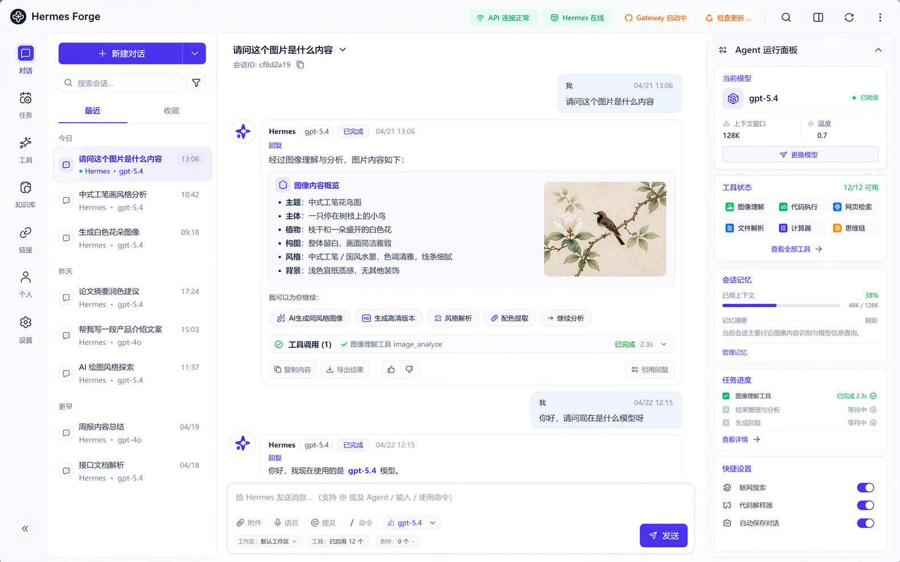

# Hermes Forge

[](https://github.com/Mahiruxia/hermes-forge/releases)
[](LICENSE)

[Hermes Agent](https://github.com/NousResearch/hermes-agent) 的本地优先桌面客户端，基于 Electron + React + TypeScript 构建。

> 社区项目，非 Hermes Agent 官方客户端。



## 定位

Hermes Forge 是以聊天为中心的 Hermes Agent 桌面助手，保留 Electron 架构。Windows 原生是主要验收平台；macOS 使用原生安装和运行策略，实际平台验收状态见 [验收记录](VALIDATION_0.2.31.md)。

核心能力：

- **引导式首启** — 按“环境检测 → 安装 Hermes → 配置模型”推进；安装来源由用户确认，缺失依赖可就地修复。
- **模型同步** — 桌面端模型配置实时同步至 Hermes CLI 与 Gateway 运行时，避免多端配置漂移。
- **聊天与工作区** — 会话搜索、恢复、附件和真实消息导出；项目与空间合并为工作区与最近目录。
- **官方交互回调** — 工具审批和澄清问题通过请求 ID 回到原任务，支持取消和明确的失败终态。
- **技能与记忆** — 统一入口，打开时才加载；Profile 管理位于高级设置。
- **按需扩展** — 消息连接器、定时任务和桌面自动化默认关闭；迁移保留已明确启用的设置。
- **自动更新** — `electron-updater` + GitHub Releases，支持静默检查、后台下载与进度追踪。

## 下载

| 平台 | 下载 |
|------|------|
| Windows (x64) | [`Hermes-Forge-x.y.z-x64.exe`](https://github.com/Mahiruxia/hermes-forge/releases) |
| macOS (Apple Silicon) | [`Hermes-Forge-x.y.z-arm64.dmg`](https://github.com/Mahiruxia/hermes-forge/releases) |

> 当前为未签名二进制，首次启动时系统安全提示为预期行为。

## 首次使用

1. 启动后点击“检测环境”，检查本机 Hermes 安装。
2. 未发现 Hermes 时，点击“选择安装方式”，优先使用官方 GitHub；网络受限时可主动选择国内社区镜像。
3. Hermes 就绪后继续配置模型来源和 API Key。密钥只保存到本机安全存储，不会在界面回显。
4. 进入工作台并选择项目目录，然后描述希望完成的目标。

常用快捷键：

- `Ctrl/Cmd + K`：聚焦任务输入框
- `Ctrl/Cmd + N`：新建会话
- `Ctrl/Cmd + O`：选择工作区
- `Ctrl/Cmd + B`：展开或收起会话栏

## 开发

环境要求：Node.js 22.12+、npm 10+、Git、uv。Hermes 支持 Python 3.11–3.13，新安装使用 uv 管理的 Python 3.11。

```bash
git clone https://github.com/Mahiruxia/hermes-forge.git
cd hermes-forge
npm ci
cp .env.example .env
npm run dev
```

开发模式会由 Electron 主进程加载仓库根目录的 `.env`，且不会覆盖终端中已经设置的同名环境变量。生产安装包不读取工作目录中的 `.env`；模型凭证应通过应用内设置保存到系统安全存储。

```bash
npm run check    # TypeScript
npm test         # Vitest
npm run build    # 生产构建
```

## Hermes 版本与运行环境

当前默认锁定官方 **0.21.3 / v2026.9.14**，提交 `345cd2b057a452236de401d3534b8502a7465e8d`，版本清单位于 `src/install/hermes-version-constants.ts`。

升级在原目录进行，支持旧分支、标签与 detached HEAD。使用官方 `uv.lock` 同步核心依赖、MCP 和已启用扩展需要的 extras，不安装全部可选依赖。聊天、Gateway、会话数据库和诊断统一使用安装目录内的 `venv`，旧环境仅在没有 `venv` 时兼容 `.venv`。不会向系统 Python 安装包，也不自动 stash 或创建升级备份。

升级前检查任务与 Gateway，下载和核实目标提交后再切换。失败报告保留具体阶段；重试沿用同一目录。除已确认可替换的 `uv.lock` 外，存在源码修改时停止升级并提示。

## 运行时路径解析

Hermes 根目录按以下优先级解析：

1. 应用设置中保存的路径
2. `HERMES_HOME`
3. `HERMES_AGENT_HOME`
4. 平台默认安装目录（Windows 为 `%LOCALAPPDATA%/hermes/hermes-agent`）
5. 旧版 `~/Hermes Agent` 或 `<project-root>/Hermes Agent`

构建时可通过环境变量覆盖：

```dotenv
HERMES_INSTALL_REPO_URL=https://github.com/NousResearch/hermes-agent.git
```

## 架构

```
src/
  main/       Electron 主进程、IPC、配置、密钥、连接器与原生服务
  preload/    Renderer 安全桥接层
  renderer/   React UI、工作台、设置中心、连接器面板
  adapters/   Hermes CLI 适配、输出解析、启动元数据
  process/    任务运行器、命令运行器、快照、工作区锁
  setup/      首启体检、自动安装、依赖修复
  updater/    GitHub Releases 自动更新
  security/   路径校验、权限常量
  shared/     类型、Schema、IPC 通道
```

设计原则：

- **Hermes-only** — 单引擎执行，无多引擎分支。
- **主进程可信边界** — 密钥、文件系统、子进程、Gateway 与原生能力集中于主进程。
- **白名单 IPC** — Renderer 仅通过显式 Preload API 与主进程交互。
- **可恢复首启** — 依赖缺失时给出可操作的修复路径，而非堆栈错误。
- **本地优先** — 会话、附件、快照与日志默认留存于用户本机。

## 能力与路线

- [能力矩阵](CAPABILITY_MATRIX.md)
- [路线图](ROADMAP.md)

## 贡献

欢迎提交 Issue、Discussion 与 Draft PR。当前优先方向：

- 首启与依赖修复体验
- Windows 物理机兼容性
- 连接器 Gateway 长期运行稳定性
- 飞书 / QQ Bot runtime adapter 与多实例状态诊断
- Windows 桥接审批 UX 与审计展示
- Electron E2E / smoke 测试
- 代码签名与 release provenance

```bash
npm run check && npm test
```

详见 [CONTRIBUTING.md](CONTRIBUTING.md) 与 [SECURITY.md](SECURITY.md)。

## License

MIT
